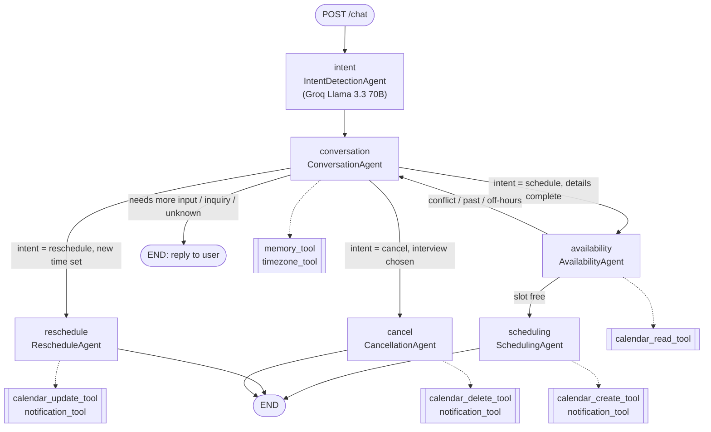

# AI Interview Scheduler

A multi-agent chat assistant, built on LangGraph, that schedules, reschedules and cancels interviews through conversation. Every agent step and tool call is traced and shown in the UI.

**Live demo:** https://ai-interview-chatbot-gilt.vercel.app

## Why

Booking an interview usually takes several emails: who you are, when you are free, which timezone, then a confirmation. This project does that in one chat. An LLM works out what the user wants. Deterministic agents and validated tools then collect the details, check for conflicts, write the booking and send the email. The trace panel shows exactly what ran.

## Key features

- **LLM intent detection**: `IntentDetectionAgent` uses Groq (`llama-3.3-70b-versatile`) to label each message as `schedule`, `reschedule`, `cancel` or `inquiry`. It returns strict JSON with a confidence score. Anything below 0.60 confidence becomes `unknown`.
- **Slot filling across turns**: `ConversationAgent` asks for name, email, preferred date/time and timezone one at a time. It validates emails, pulls fields out of free text, and saves which field it is waiting for, so the next reply skips intent detection.
- **Availability checks**: `AvailabilityAgent` rejects times in the past and times outside working hours. It reads the interviewer's busy slots with `calendar_read_tool` (60-minute interviews) and checks the requested time against them with a 30-minute buffer.
- **Booking, rescheduling and cancelling**: `SchedulingAgent`, `RescheduleAgent` and `CancellationAgent` call `calendar_create_tool`, `calendar_update_tool` and `calendar_delete_tool`, then `notification_tool`. For reschedule and cancel, the user picks the interview from a numbered list of their upcoming ones.
- **Timezone handling**: `timezone_tool` uses `dateutil` and `zoneinfo` to convert user-entered times to UTC. `IST` is accepted as an alias for `Asia/Kolkata`.
- **Typed tools**: every tool checks its input with a Pydantic model. Each one returns a structured result with its own trace (`trace_id`, start and finish timestamps, status such as `success`, `validation_error`, `not_found` or `runtime_error`).
- **Email notifications**: `notification_tool` sends a confirmation over SMTP. It is set up for a Mailtrap sandbox.
- **Observability UI**: a status bar shows the active agent. The Agent Timeline lists each agent step, the Tool Inspector shows each tool call, and a Calendar view lists scheduled interviews from `GET /interviews`.

## Architecture

The graph is defined in `backend/app/graph/interview_graph.py`. Node names below match the code.



Note: the "calendar" tools work on the `interviews` table in SQLite. They do not connect to an external calendar provider.

## How a message flows

1. The React client sends `{ user_message, conversation_id }` to `POST /chat`. On the first message, FastAPI creates a `conversation_id` (UUID).
2. The `intent` node loads that conversation's saved state with `memory_tool` (a `conversation_memory` table in SQLite). If the assistant is waiting for a specific field, it keeps the saved intent and skips the LLM. Otherwise `IntentDetectionAgent` classifies the message.
3. `ConversationAgent` merges the message into the saved state, fills the next missing field and saves the state again. If information is still missing, it marks the turn incomplete, the graph ends, and the user sees the next question.
4. When the details are complete, `timezone_tool` converts the requested time to UTC, and the graph routes on intent to `availability`, `reschedule` or `cancel`.
5. `AvailabilityAgent` checks the slot with `calendar_read_tool`. If the slot is taken, flow goes back to `conversation`, which asks for another time. If it is free, `SchedulingAgent` creates the interview row, calls `calendar_create_tool` and then `notification_tool`, and sets the interview status (`scheduled`, `calendar_failed` or `notification_failed`).
6. Each node calls `agent_trace`, and each tool call goes through `tool_trace` (`backend/app/tools/trace.py`). This adds timestamped `agent` and `tool` entries to `state["trace"]`, which `/chat` returns with the reply.
7. The frontend splits the trace into the Agent Timeline (agent entries) and the Tool Inspector (tool entries) and updates the active-agent status bar. Chat history and trace are kept in `localStorage`, so they survive a page reload.

## Tech stack

| Layer | Tools |
|---|---|
| Orchestration | LangGraph (`StateGraph`) |
| LLM | Groq API, `llama-3.3-70b-versatile` (intent classification and general replies) |
| Backend | FastAPI, Uvicorn, Pydantic, SQLAlchemy, SQLite, python-dateutil, python-dotenv |
| Notifications | SMTP (Mailtrap sandbox) |
| Frontend | React 19, Vite 7, Tailwind CSS 4, Axios |
| Hosting | Frontend on Vercel. The client points to a backend hosted on Render. |

`requirements.txt` also lists `langchain` and `openai`. The application code does not import either one.

## Project structure

```
backend/
  app/
    main.py                 # FastAPI app, /chat endpoint, graph invocation
    config.py               # env loading
    graph/interview_graph.py
    agents/                 # intent, conversation, availability, scheduling, reschedule, cancellation
    tools/                  # calendar_{create,read,update,delete}, timezone, notification, memory, trace
    api/interviews.py       # GET /interviews
    db/                     # SQLAlchemy engine, session, models (Candidate, Interviewer, Interview)
    schemas/
  requirements.txt
frontend/
  src/
    api/client.js           # Axios client (backend base URL)
    pages/                  # InterviewAssistant, CalendarView
    components/             # ChatBox, MessageList, StatusBar, Timeline, ToolInspector
```

## Run locally

**Backend**

```bash
cd backend
python -m venv .venv
source .venv/bin/activate        # Windows: .venv\Scripts\activate
pip install -r requirements.txt
# create backend/.env with the variables below
uvicorn app.main:app --reload --port 8000
```

The SQLite database (`interview_scheduler.db`) is created automatically on first run.

Environment variables (names only):

- `GROQ_API_KEY` (required)
- `FRONTEND_URL` (CORS origin, defaults to `http://localhost:5173`)
- `MAILTRAP_USERNAME`, `MAILTRAP_PASSWORD` (needed for notifications to succeed)
- `MAILTRAP_HOST`, `MAILTRAP_PORT`, `MAILTRAP_FROM` (optional, have defaults)

**Frontend**

```bash
cd frontend
npm install
npm run dev
```

`frontend/src/api/client.js` has the deployed backend URL hardcoded. To use a local backend, change `baseURL` to `http://localhost:8000`.

## Possible next steps

- Replace the SQLite-backed calendar tools with a real calendar API (Google Calendar or Outlook) and support more than one interviewer. Right now the first interviewer record is always used.
- Add automated tests for the routing functions and the tools, and read the backend URL from a Vite environment variable.
